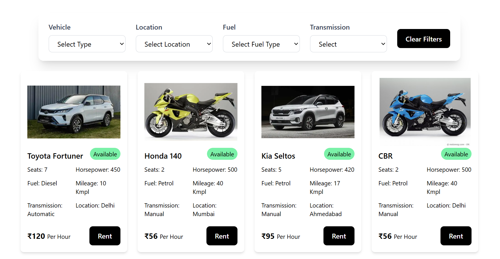

# 🚗 Drivee - Vehicle Rental Web Application

Drivee is a modern and user-friendly vehicle rental platform where users can browse, book, and pay for cars and bikes online. It includes features for both customers and vehicle owners (admins) to manage bookings, view rental history, and handle fleet operations efficiently.

## 🌐 Live Demo

👉 [View Live](https://drivee-azure.vercel.app)

---
## 📸 Screenshots





## ✨ Features

### 🚘 Customer Features
- User authentication (Google login)
- Browse vehicles by location, type, fuel, and transmission
- View detailed vehicle info and availability
- Book vehicles by selecting pick-up and drop-off date/time
- Get real-time price calculation
- Secure payment with Razorpay
- View booking history

### 🧑‍💼 Admin/Owner Features
- Admin login
- Add new vehicles with specs and image
- Manage existing cars (edit/delete)
- Manage bookings (view & cancel)
- View payment status (paid/pending)

---

## 🛠 Tech Stack

| Frontend       | Backend         | Database        | Auth & Storage     | Tools & Libs               |
|----------------|-----------------|-----------------|--------------------|----------------------------|
| React.js       | Firebase SDK    | Firestore       | Firebase Auth      | Zustand, React Query       |
| Tailwind CSS   | Docker, AWS, CI/CD Jenkins |                 | Firebase Storage   | React Router, Toast, Razorpay |

---

## 🧑‍💻 How to Use

### 🔧 Local Setup

1. **Clone the repo**
   ```bash
   git clone https://github.com/your-username/drivee.git
   cd drivee
   .env - VITE_RAZORPAY_KEY=rzp_test_fkg78ERTx3otk8
   npm i
   npm run dev
   
